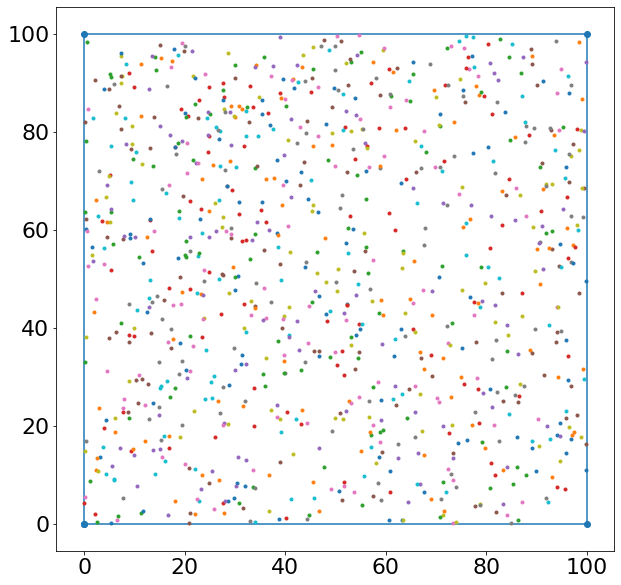
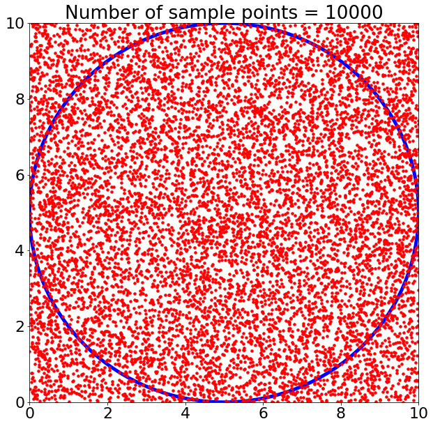
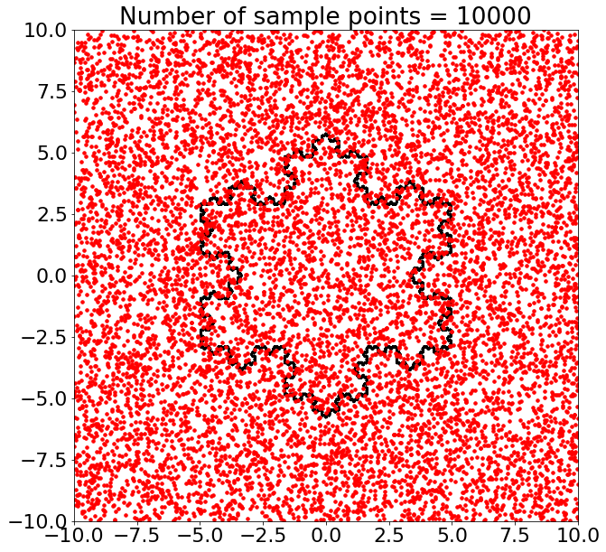

```python
import pandas as pd
import numpy as np
import matplotlib.pyplot as plt
import turtle
import random
```

# Find the Area


```python
plt.rcParams['figure.figsize'] = 10, 10
plt.rcParams.update({'font.size': 22})

rectangle = [(0,0),(0,100),(100,100),(100,0)]
n = 1000
for points in [rectangle]:
    plt.plot(*zip(*(points+points[:1])), marker='o')

    automin, automax = plt.xlim()
    plt.xlim(automin-0.5, automax+0.5)
    automin, automax = plt.ylim()
    plt.ylim(automin-0.5, automax+0.5)

    
    
for i in range(n):
    plt.plot(random.uniform(0, 100),random.uniform(0, 100),'.')


plt.savefig('foo.png')
plt.show()
```





```python
# now make a circle with no fill, which is good for hi-lighting key results

n_samples = [10,100,1000,10000]


for n in n_samples:

    circle2 = plt.Circle((5, 5), 5, color='b', fill=False,linewidth=5.0)

    ax = plt.gca()
    ax.cla() # clear things for fresh plot

    # change default range so that new circles will work
    ax.set_xlim((0, 10))
    ax.set_ylim((0, 10))

    ax.add_artist(circle2)
    for i in range(n):
        ax.plot((random.uniform(0, 10)),(random.uniform(0, 10)),'.',color='r',markersize=7 )
    plt.title('Number of sample points = '+ str(n))


    plt.savefig('Circle_'+str(n)+'.png')
```





```python
import numpy as np
import matplotlib.pyplot as plt


def koch_snowflake(order, scale=10):
    """
    Return two lists x, y of point coordinates of the Koch snowflake.

    Arguments
    ---------
    order : int
        The recursion depth.
    scale : float
        The extent of the snowflake (edge length of the base triangle).
    """
    def _koch_snowflake_complex(order):
        if order == 0:
            # initial triangle
            angles = np.array([0, 120, 240]) + 90
            return scale / np.sqrt(3) * np.exp(np.deg2rad(angles) * 1j)
        else:
            ZR = 0.5 - 0.5j * np.sqrt(3) / 3

            p1 = _koch_snowflake_complex(order - 1)  # start points
            p2 = np.roll(p1, shift=-1)  # end points
            dp = p2 - p1  # connection vectors

            new_points = np.empty(len(p1) * 4, dtype=np.complex128)
            new_points[::4] = p1
            new_points[1::4] = p1 + dp / 3
            new_points[2::4] = p1 + dp * ZR
            new_points[3::4] = p1 + dp / 3 * 2
            return new_points

    points = _koch_snowflake_complex(order)
    x, y = points.real, points.imag
    return x, y
```


```python
# now make a circle with no fill, which is good for hi-lighting key results

n_samples = [10,100,1000,10000]


for n in n_samples:

    #circle2 = plt.Circle((5, 5), 5, color='b', fill=False,linewidth=5.0)

    
    ax = plt.gca()
    ax.cla() # clear things for fresh plot

    # change default range so that new circles will work
    ax.set_xlim((-10, 10))
    ax.set_ylim((-10, 10))

    #ax.add_artist(circle2)
    for i in range(n):
        ax.plot((random.uniform(-10, 10)),(random.uniform(-10, 10)),'.',color='r',markersize=7 )
    plt.title('Number of sample points = '+ str(n))

    x, y = koch_snowflake(order=7)

    #plt.figure(figsize=(8, 8))
    #plt.axis('equal')
    ax.fill(x, y,fill=None, linewidth=2)

    plt.savefig('Snowflake_'+str(n)+'.png')
```





# Coing Toss Experiment 


```python
n_flips, probability_of_heads = 1, 0.7  
n_experiments= 100000

# we are using the binomial distribution, where the outcome will be either 0 or 1 with the probability of 50%.

s = np.random.binomial(n_flips, probability_of_heads, n_experiments)

# result of flipping a coin n=1 time, tested n_flips=10000 times.

experiment_outcome= np.where(s==1, 'Heads', 'Tails')

print(experiment_outcome)
```

    ['Tails' 'Tails' 'Heads' ... 'Heads' 'Heads' 'Heads']
    


```python
prop_heads=sum(experiment_outcome=='Heads')/len(experiment_outcome)
print(prop_heads)
```

    0.70073
    
