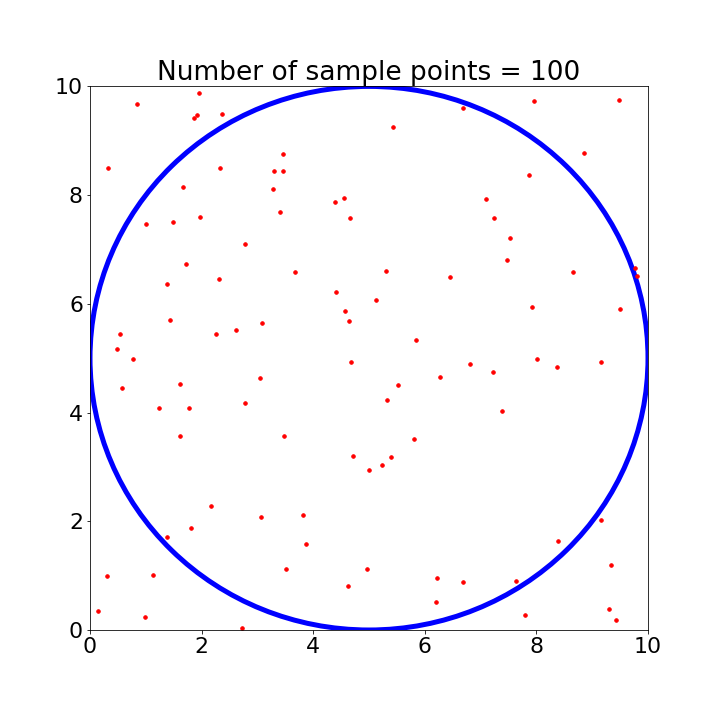
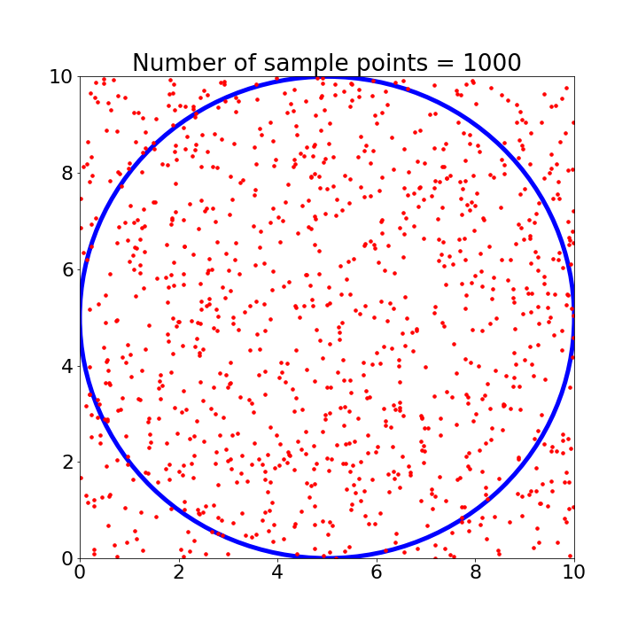
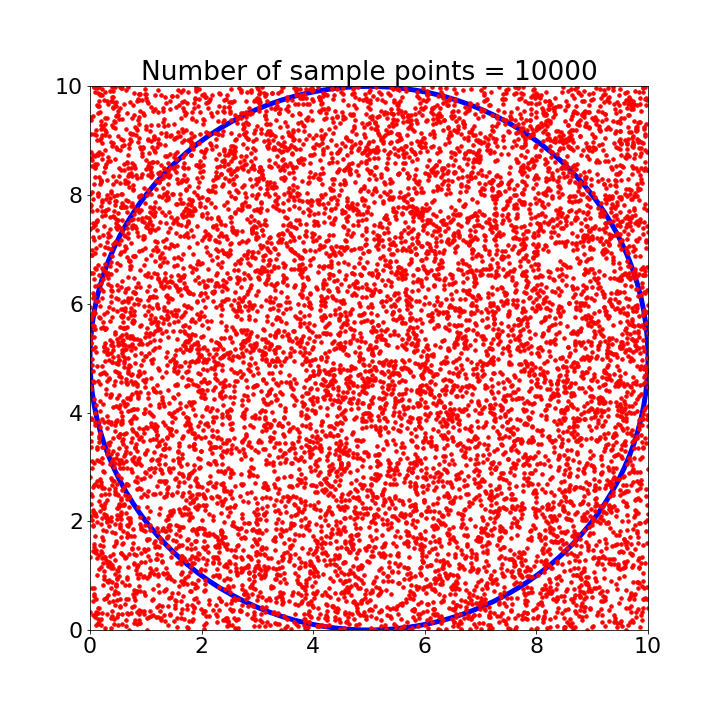
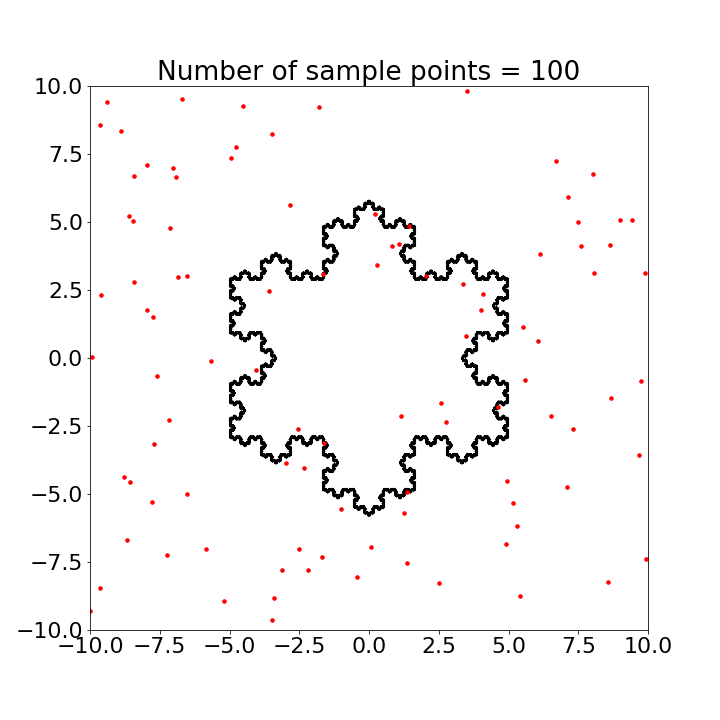
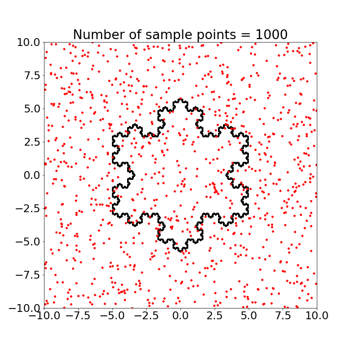
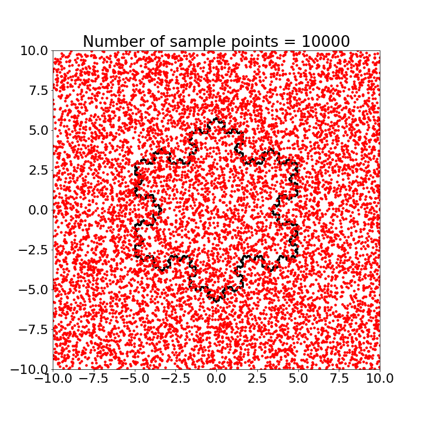

# MonteCarlo_Simulation

The notebook contains

1. Estimating the Area using Monte Carlo approach

2. Carrying out multiple coin flips to find the probability of showing up of `Heads`.

|   |   |  |   |
| ----- | ----- | ----- | ----- |
|   |   |  |   |
